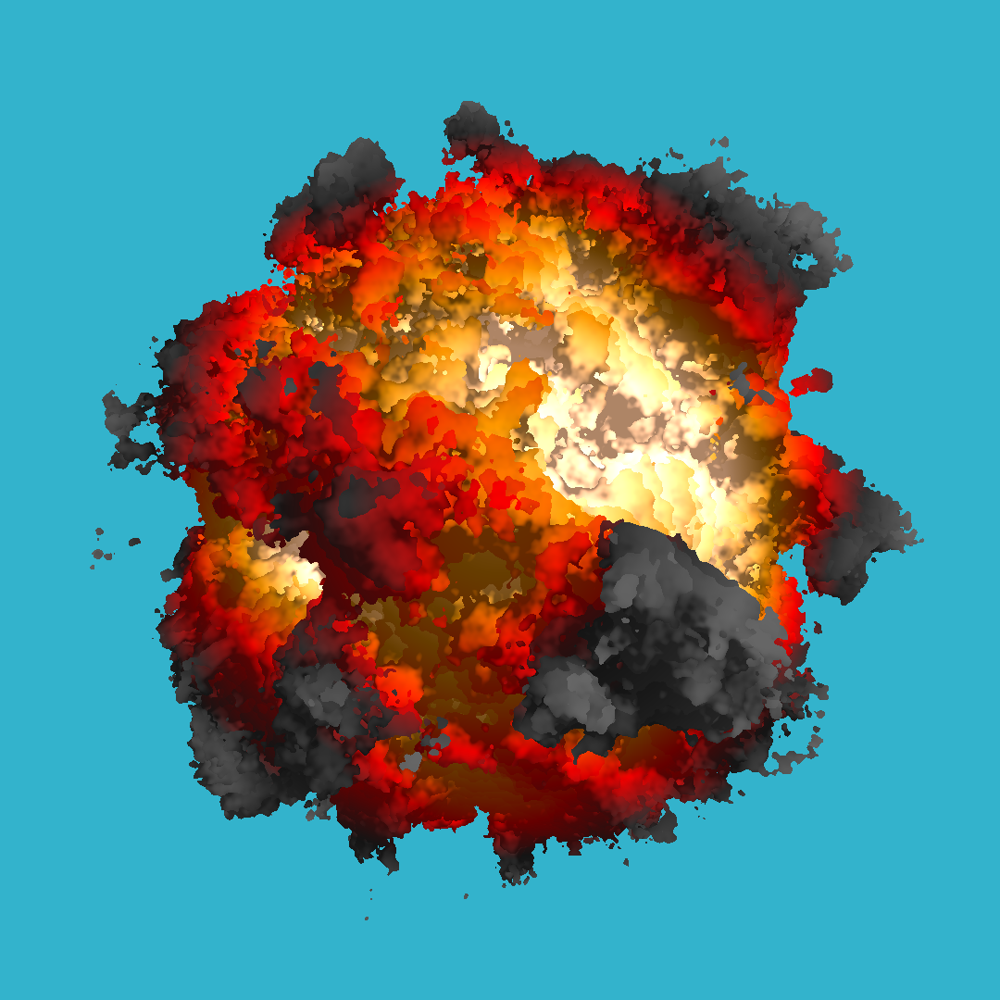

# kaboom
A very simple noise-based explosion generator, coded in modern C++.

https://github.com/DeltaPavonis/kaboom/assets/29691867/76c8149d-1f1b-4ac3-be17-6142c0cf2a90

Still image:

## Acknowledgements

- [tinykaboom](https://github.com/ssloy/tinykaboom/wiki/KABOOM!-in-180-lines-of-code). This generator was largely based off this concise and excellent tutorial written by [ssloy](https://github.com/ssloy/).
- [The Book of Shaders: Fractal Brownian Motion](https://thebookofshaders.com/13/). This article was an excellent resource for understanding Fractal Brownian Motion, the noise function used to generate the explosion cloud structures.

